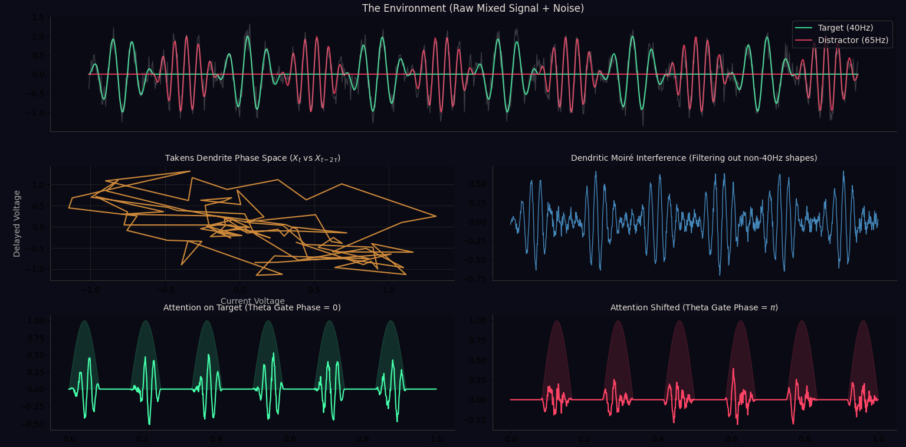

## Takens-Gated Deerskin: Attention is a Phase Shift

This repository demonstrates a biological alternative to the Transformer "Attention" mechanism.

In standard modern AI, a network pays attention to a target and ignores a distractor by updating massive weight matrices and calculating dot products across an entire sequence (`Q K^T`).

**Biological brains do not do this.** They do not calculate gradients to pay attention. They just shift their rhythm. This pure numpy simulation proves that Selective Attention can be achieved entirely through physics: Resonance and Phase-Locking.

---

# The Architecture: Biological Ground Zero

Instead of standard weight-based layers, this model uses a **Takens-Gated Deerskin Unit**, built from two core components:

# The Takens Dendrite (Geometry)

Instead of static weight matrices, this model uses delay lines (a Takens embedding) to instantly reconstruct the
phase-space geometry of an incoming time-series signal (a Strange Attractor).

- It takes a flat 1D signal and expands it into a high-dimensional trajectory.

- It multiplies this geometry against its own Receptor Mosaic (Moiré interference).

- If the geometries match, the signal resonates.

### 2. The Theta Soma (Time)
- While high-frequency waves (Alpha/Gamma) act as strange attractors carrying complex content, low-frequency waves (Theta) act as a strict, rigid pacemaker.
- The Soma acts as an **exact Theta Gate**.
- It only allows information to pass if it arrives during the positive peak of its internal clock.

---

## The Experiment: Attention Without Weights

In this simulation, we feed the network a chaotic environment containing two alternating bursts:

- **Target Signal:** 40Hz Gamma wave  
- **Distractor Signal:** 65Hz Gamma wave  

To switch attention from the Target to the Distractor, the network **does not change a single weight**. It simply shifts the phase of its internal Theta clock.

- **Phase = 0:** The gate is open when the Target arrives. Output is amplified.  
- **Phase = π:** The gate is shifted. It is now closed when the Target hits, and open when the Distractor hits. Because the dendrite's geometry weakened the distractor, the output flatlines.

## How to Run

1. Clone the repository.
2. Install the lightweight dependencies:
   `pip install -r requirements.txt`
3. Run the simulation:
   `python takens_gated_deerskin.py`
